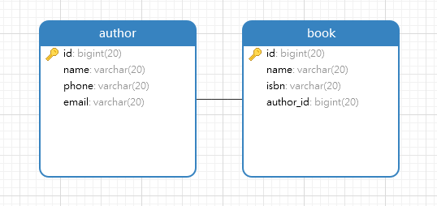

# springboot jpa的尝试

## 前言

工程介绍了spring boot  jpa的常用的几种用法

## 工程说明


|序号|工程名|作用|
|---|---|---|
|1|jpa-1|jpa的简单应用
|2|jpa-one-to-one|jpa one to one 的使用方法|
|2|jpa-one-to-many||
|2|jpa-many-to-one||
|2|jpa-many-to-many||


## one to one



```sql
CREATE TABLE `author` (
`id` bigint(20) NOT NULL AUTO_INCREMENT,
`name` varchar(20) NULL,
`phone` varchar(20) NULL,
`email` varchar(20) NULL,
PRIMARY KEY (`id`)
);
CREATE TABLE `book` (
`id` bigint(20) NOT NULL AUTO_INCREMENT,
`name` varchar(20) NULL,
`isbn` varchar(20) NULL,
`author_id` bigint(20) NULL,
PRIMARY KEY (`id`)
);
ALTER TABLE `book` ADD CONSTRAINT `fk_author` FOREIGN KEY (`author_id`) REFERENCES `author` (`id`);
```